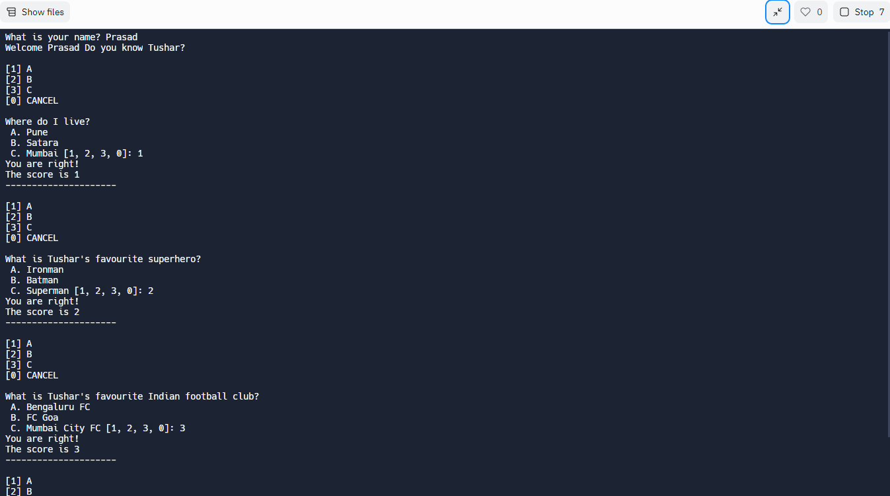

<h1>How Well Do You Know Tushar Anekar?</h1>
A simple CLI app built with using REPLIT with the help of NodeJS language.

<h1>How does it work?</h1>
Answer 5 basic questions of Tushar Anekar, you will be given 3 options for every question and answer then by entering [1,2,3] as answers.

<h1>What is used in this application?</h1>
<ul>
    <li>Array</li>
    <li>Function</li>
    <li>Object</li>
    <li>Loop</li>
</ul>

